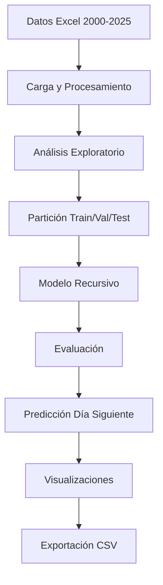
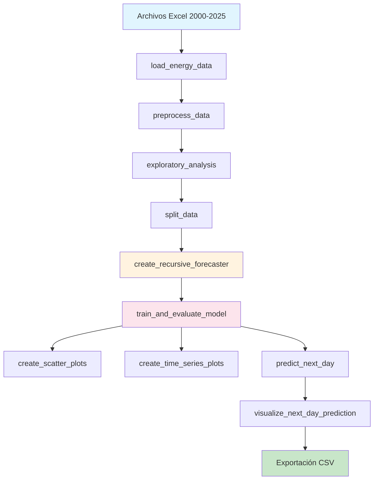

# Documentación Técnica: Forecasting Recursivo Multi-Step para Demanda Energética

## Tabla de Contenidos

1. [Introducción](#introducción)
2. [Arquitectura del Sistema](#arquitectura-del-sistema)
3. [Análisis Detallado del Código](#análisis-detallado-del-código)
4. [Funciones Principales](#funciones-principales)
5. [Flujo de Datos](#flujo-de-datos)
6. [Modelo de Machine Learning](#modelo-de-machine-learning)
7. [Visualizaciones](#visualizaciones)
8. [Métricas de Evaluación](#métricas-de-evaluación)
9. [Casos de Uso](#casos-de-uso)
10. [Troubleshooting](#troubleshooting)

---

## Introducción

Este documento proporciona una explicación técnica detallada del notebook `forecasting_demanda_energia.ipynb`, que implementa un sistema de forecasting recursivo multi-step para la predicción de demanda energética utilizando la clase `ForecasterRecursive` de la librería skforecast.

### Objetivo Principal
Predecir la demanda energética del día siguiente (24 horas) utilizando un modelo de machine learning que aprende patrones temporales complejos de los datos históricos.

### Metodología
El forecasting recursivo multi-step utiliza las propias predicciones del modelo como entrada para predecir valores futuros, creando un proceso iterativo que captura dependencias temporales de largo plazo.

---

## Arquitectura del Sistema



### Componentes Principales

1. **Capa de Datos**: Carga y procesamiento de archivos Excel
2. **Capa de Análisis**: Exploración y visualización de datos
3. **Capa de Modelado**: Implementación del modelo recursivo
4. **Capa de Evaluación**: Métricas y validación
5. **Capa de Predicción**: Generación de pronósticos
6. **Capa de Visualización**: Gráficos interactivos y estáticos

---

## Análisis Detallado del Código

### 1. Importación de Librerías

```python
# Tratamiento de datos
import numpy as np
import pandas as pd

# Visualización
import matplotlib.pyplot as plt
import seaborn as sns
import plotly.graph_objects as go
import plotly.express as px
from plotly.subplots import make_subplots

# Forecasting y ML
from skforecast.recursive import ForecasterRecursive
from skforecast.model_selection import TimeSeriesFold, backtesting_forecaster
from skforecast.preprocessing import RollingFeatures
from lightgbm import LGBMRegressor
from sklearn.metrics import mean_absolute_error, mean_squared_error, r2_score
```

**Propósito**: Importar todas las dependencias necesarias para el procesamiento de datos, modelado y visualización.

**Librerías Clave**:
- `skforecast`: Framework especializado en forecasting de series temporales
- `lightgbm`: Algoritmo de gradient boosting para el modelo base
- `plotly`: Visualizaciones interactivas
- `matplotlib/seaborn`: Visualizaciones estáticas

### 2. Carga y Procesamiento de Datos

#### Función `load_energy_data()`

```python
def load_energy_data():
    """
    Carga y procesa los datos de demanda energética desde múltiples archivos Excel
    """
    import os
    import glob
    
    # Buscar archivos Excel en la carpeta demanda-energia-sin/
    data_folder = 'demanda-energia-sin'
    excel_files = glob.glob(os.path.join(data_folder, '*.xlsx'))
    excel_files.sort()
    
    # Cargar y combinar todos los archivos
    all_data = []
    for file_path in excel_files:
        df = pd.read_excel(file_path, header=3)
        year = os.path.basename(file_path).split('_')[-1].replace('.xlsx', '')
        df['year'] = int(year)
        all_data.append(df)
    
    datos = pd.concat(all_data, ignore_index=True)
    return datos
```

**Funcionalidad**:
- **Detección automática**: Busca todos los archivos `.xlsx` en la carpeta
- **Carga secuencial**: Lee cada archivo con header en fila 3
- **Extracción de metadatos**: Obtiene el año del nombre del archivo
- **Concatenación**: Combina todos los datos en un DataFrame único

**Parámetros**:
- `header=3`: Los datos comienzan en la fila 4 (0-indexed)
- `ignore_index=True`: Reinicia el índice al concatenar

#### Función `preprocess_data()`

```python
def preprocess_data(datos_raw):
    """
    Procesa los datos para crear una serie temporal de demanda energética
    """
    # Detectar columnas automáticamente
    date_columns = []
    demand_columns = []
    
    for col in datos_raw.columns:
        col_lower = col.lower()
        if any(keyword in col_lower for keyword in ['fecha', 'date', 'time', 'tiempo']):
            date_columns.append(col)
        if any(keyword in col_lower for keyword in ['demanda', 'demand', 'consumo', 'consumption', 'energia', 'energy']):
            demand_columns.append(col)
    
    # Preparar datos
    datos = datos_raw[[date_col, demand_col]].copy()
    datos.columns = ['Time', 'Demand']
    
    # Convertir fecha y limpiar
    datos['Time'] = pd.to_datetime(datos['Time'], errors='coerce')
    datos = datos.dropna()
    datos = datos.set_index('Time')
    datos = datos.sort_index()
```

**Funcionalidad**:
- **Detección inteligente**: Identifica columnas de fecha y demanda por palabras clave
- **Limpieza de datos**: Elimina valores nulos y convierte fechas
- **Indexación temporal**: Establece la fecha como índice
- **Conversión horaria**: Si los datos son diarios, los convierte a horarios simulados

**Algoritmo de Conversión Diaria a Horaria**:
```python
if freq_detected is None or freq_detected == 'D':
    for fecha, row in datos.iterrows():
        for hora in range(24):
            # Patrón diario típico de demanda eléctrica
            if 8 <= hora <= 10 or 18 <= hora <= 20:  # Picos
                factor = 1.2 + 0.3 * np.sin(2 * np.pi * hora / 24)
            elif 22 <= hora or hora <= 6:  # Valle nocturno
                factor = 0.6 + 0.2 * np.sin(2 * np.pi * hora / 24)
            else:  # Base
                factor = 0.8 + 0.2 * np.sin(2 * np.pi * hora / 24)
            
            # Agregar variabilidad aleatoria
            factor += np.random.normal(0, 0.1)
            factor = max(0.3, factor)
            
            demanda_horaria = row['Demand'] * factor / 24
```

**Características del Patrón Simulado**:
- **Picos**: 8-10 AM y 6-8 PM (factor 1.2-1.5)
- **Valle nocturno**: 10 PM - 6 AM (factor 0.6-0.8)
- **Base**: Resto del día (factor 0.8-1.0)
- **Variabilidad**: Ruido gaussiano para realismo

### 3. Análisis Exploratorio

#### Función `exploratory_analysis()`

```python
def exploratory_analysis(datos):
    """
    Realiza análisis exploratorio de la serie temporal
    """
    # Estadísticas básicas
    print(f"📅 Período: {datos.index.min()} a {datos.index.max()}")
    print(f"⏱️  Duración: {(datos.index.max() - datos.index.min()).days} días")
    print(f"📈 Total observaciones: {len(datos):,}")
    print(f"🕐 Frecuencia: {pd.infer_freq(datos.index)}")
    
    # Gráfico de la serie temporal completa
    fig = go.Figure()
    fig.add_trace(go.Scatter(
        x=datos.index, 
        y=datos['Demand'], 
        mode='lines', 
        name='Demanda Energética',
        line=dict(color='blue', width=1)
    ))
    
    # Gráfico de distribución
    fig, (ax1, ax2) = plt.subplots(1, 2, figsize=(15, 5))
    ax1.hist(datos['Demand'], bins=50, alpha=0.7, color='skyblue', edgecolor='black')
    ax2.boxplot(datos['Demand'], patch_artist=True, 
                boxprops=dict(facecolor='lightgreen', alpha=0.7))
```

**Funcionalidad**:
- **Estadísticas descriptivas**: Resumen numérico de la serie temporal
- **Visualización temporal**: Gráfico de línea de la demanda completa
- **Análisis de distribución**: Histograma y box plot
- **Detección de patrones**: Identificación de tendencias y estacionalidad

**Métricas Calculadas**:
- Período temporal total
- Número de observaciones
- Frecuencia de los datos
- Estadísticas descriptivas (mean, std, min, max, percentiles)

### 4. Partición de Datos

#### Función `split_data()`

```python
def split_data(datos, train_ratio=0.7, val_ratio=0.15, test_ratio=0.15):
    """
    Divide los datos en conjuntos de entrenamiento, validación y prueba
    """
    # Verificar que las proporciones sumen 1
    assert abs(train_ratio + val_ratio + test_ratio - 1.0) < 1e-6
    
    total_len = len(datos)
    train_len = int(total_len * train_ratio)
    val_len = int(total_len * val_ratio)
    
    # Dividir los datos
    datos_train = datos.iloc[:train_len].copy()
    datos_val = datos.iloc[train_len:train_len + val_len].copy()
    datos_test = datos.iloc[train_len + val_len:].copy()
    
    # Obtener fechas de corte
    fin_train = datos_train.index[-1]
    fin_validacion = datos_val.index[-1]
```

**Funcionalidad**:
- **División temporal**: Respeta el orden cronológico de los datos
- **Proporciones configurables**: 70% train, 15% val, 15% test por defecto
- **Validación de entrada**: Verifica que las proporciones sumen 1
- **Visualización**: Muestra la división con líneas verticales

**Importancia de la División Temporal**:
- **Evita data leakage**: Los datos futuros no se usan para predecir el pasado
- **Simula condiciones reales**: El modelo se entrena solo con datos históricos
- **Validación robusta**: Evalúa el rendimiento en datos no vistos

### 5. Modelo de Machine Learning

#### Función `create_recursive_forecaster()`

```python
def create_recursive_forecaster():
    """
    Crea un forecaster recursivo multi-step con LightGBM
    """
    # Configurar el regresor LightGBM
    regressor = LGBMRegressor(
        n_estimators=100,
        max_depth=6,
        learning_rate=0.1,
        random_state=42,
        verbose=-1
    )
    
    # Crear features de ventana deslizante
    window_features = RollingFeatures(
        stats=["mean", "std"], 
        window_sizes=[24, 24*7]  # 24 horas y 7 días
    )
    
    # Crear el forecaster recursivo
    forecaster = ForecasterRecursive(
        regressor=regressor,
        lags=24,  # Usar las últimas 24 horas como predictores
        window_features=window_features
    )
```

**Componentes del Modelo**:

1. **Regresor Base (LightGBM)**:
   - `n_estimators=100`: Número de árboles
   - `max_depth=6`: Profundidad máxima de los árboles
   - `learning_rate=0.1`: Tasa de aprendizaje
   - `random_state=42`: Semilla para reproducibilidad

2. **Features de Ventana Deslizante**:
   - `window_sizes=[24, 24*7]`: Ventanas de 24 horas y 7 días
   - `stats=["mean", "std"]`: Media y desviación estándar
   - **Propósito**: Capturar patrones de corto y largo plazo

3. **Lags**:
   - `lags=24`: Usa las últimas 24 horas como predictores
   - **Propósito**: Capturar dependencias temporales inmediatas

#### Función `train_and_evaluate_model()`

```python
def train_and_evaluate_model(forecaster, datos_train, datos_val, datos_test):
    """
    Entrena el modelo y evalúa su rendimiento
    """
    # Entrenar el modelo
    forecaster.fit(y=datos_train['Demand'])
    
    # Realizar predicciones
    predicciones_val = forecaster.predict(steps=len(datos_val))
    predicciones_test = forecaster.predict(steps=len(datos_test))
    
    # Calcular métricas
    def calculate_metrics(y_true, y_pred, dataset_name):
        mae = mean_absolute_error(y_true, y_pred)
        mse = mean_squared_error(y_true, y_pred)
        rmse = np.sqrt(mse)
        r2 = r2_score(y_true, y_pred)
        
        return {'MAE': mae, 'MSE': mse, 'RMSE': rmse, 'R2': r2}
```

**Proceso de Entrenamiento**:
1. **Fit**: Entrena el modelo con datos de entrenamiento
2. **Predict**: Genera predicciones para validación y prueba
3. **Evaluate**: Calcula métricas de rendimiento

**Métricas de Evaluación**:
- **MAE (Mean Absolute Error)**: Error absoluto promedio
- **MSE (Mean Squared Error)**: Error cuadrático promedio
- **RMSE (Root Mean Squared Error)**: Raíz del error cuadrático promedio
- **R² (Coefficient of Determination)**: Coeficiente de determinación

### 6. Visualizaciones

#### Función `create_scatter_plots()`

```python
def create_scatter_plots(datos_val, predicciones_val, datos_test, predicciones_test):
    """
    Crea gráficos de dispersión para comparar valores reales vs predichos
    """
    # Crear subplots
    fig, axes = plt.subplots(1, 2, figsize=(15, 6))
    
    # Gráfico de dispersión para validación
    axes[0].scatter(datos_val['Demand'], predicciones_val, alpha=0.6, color='blue')
    axes[0].plot([datos_val['Demand'].min(), datos_val['Demand'].max()], 
                 [datos_val['Demand'].min(), datos_val['Demand'].max()], 
                 'r--', lw=2, label='Línea perfecta')
    
    # Gráfico interactivo con Plotly
    fig = make_subplots(
        rows=1, cols=2,
        subplot_titles=('Validación: Real vs Predicho', 'Prueba: Real vs Predicho')
    )
```

**Tipos de Visualizaciones**:

1. **Gráficos de Dispersión**:
   - Comparación directa entre valores reales y predichos
   - Línea de referencia para predicción perfecta
   - Identificación de sesgos y patrones de error

2. **Series Temporales**:
   - Superposición de datos reales y predicciones
   - Identificación de patrones temporales
   - Evaluación visual del rendimiento

3. **Gráficos Interactivos (Plotly)**:
   - Zoom y pan para análisis detallado
   - Tooltips con información específica
   - Exportación de imágenes

#### Función `create_time_series_plots()`

```python
def create_time_series_plots(datos_train, datos_val, datos_test, predicciones_val, predicciones_test):
    """
    Crea gráficos de series temporales mostrando las predicciones
    """
    fig = go.Figure()
    
    # Datos de entrenamiento
    fig.add_trace(go.Scatter(
        x=datos_train.index,
        y=datos_train['Demand'],
        mode='lines',
        name='Entrenamiento',
        line=dict(color='blue', width=1)
    ))
    
    # Datos reales de validación
    fig.add_trace(go.Scatter(
        x=datos_val.index,
        y=datos_val['Demand'],
        mode='lines',
        name='Validación (Real)',
        line=dict(color='orange', width=1)
    ))
    
    # Predicciones de validación
    fig.add_trace(go.Scatter(
        x=datos_val.index,
        y=predicciones_val,
        mode='lines',
        name='Validación (Predicho)',
        line=dict(color='orange', width=2, dash='dash')
    ))
```

**Características de las Visualizaciones**:
- **Colores diferenciados**: Cada conjunto de datos tiene un color único
- **Estilos de línea**: Líneas sólidas para datos reales, punteadas para predicciones
- **Leyendas informativas**: Identificación clara de cada elemento
- **Interactividad**: Hover, zoom y pan para análisis detallado

### 7. Predicción del Día Siguiente

#### Función `predict_next_day()`

```python
def predict_next_day(forecaster, datos):
    """
    Predice la demanda energética para el día siguiente
    """
    # Obtener la última fecha de los datos
    ultima_fecha = datos.index.max()
    
    # Calcular la fecha del día siguiente
    siguiente_dia = ultima_fecha + pd.Timedelta(days=1)
    
    # Crear fechas para las 24 horas del día siguiente
    horas_siguiente_dia = pd.date_range(
        start=siguiente_dia.replace(hour=0, minute=0, second=0),
        end=siguiente_dia.replace(hour=23, minute=0, second=0),
        freq='H'
    )
    
    # Realizar la predicción para las 24 horas del día siguiente
    prediccion_siguiente = forecaster.predict(steps=24)
    
    # Calcular estadísticas de la predicción
    demanda_total_dia = prediccion_siguiente.sum()
    demanda_promedio = prediccion_siguiente.mean()
    demanda_maxima = prediccion_siguiente.max()
    demanda_minima = prediccion_siguiente.min()
    hora_pico = horas_siguiente_dia[prediccion_siguiente.argmax()]
    hora_valle = horas_siguiente_dia[prediccion_siguiente.argmin()]
```

**Funcionalidad**:
- **Cálculo de fechas**: Determina automáticamente el día siguiente
- **Generación de timestamps**: Crea 24 horas consecutivas
- **Predicción multi-step**: Genera 24 predicciones secuenciales
- **Análisis estadístico**: Calcula métricas de resumen

**Estadísticas Calculadas**:
- **Demanda total del día**: Suma de las 24 horas
- **Demanda promedio**: Media de las predicciones
- **Demanda máxima/mínima**: Picos y valles
- **Horas de pico/valle**: Timestamps de extremos

#### Función `visualize_next_day_prediction()`

```python
def visualize_next_day_prediction(datos, horas_siguiente_dia, prediccion_siguiente):
    """
    Visualiza la predicción del día siguiente junto con datos históricos
    """
    # Agregar datos históricos de los últimos 7 días para contexto
    datos_historicos = datos.tail(7 * 24)  # Últimos 7 días
    
    # Agregar predicción del día siguiente
    fig.add_trace(go.Scatter(
        x=horas_siguiente_dia, 
        y=prediccion_siguiente, 
        mode='lines+markers', 
        name=f'Predicción {horas_siguiente_dia[0].date()}',
        line=dict(color='red', width=3),
        marker=dict(size=6, color='red')
    ))
    
    # Crear gráfico de barras para la predicción del día siguiente
    fig_barras = go.Figure()
    fig_barras.add_trace(go.Bar(
        x=[h.strftime('%H:%M') for h in horas_siguiente_dia],
        y=prediccion_siguiente,
        name='Demanda Predicha',
        marker_color='lightcoral'
    ))
```

**Tipos de Visualizaciones**:
1. **Serie temporal con contexto**: Últimos 7 días + predicción
2. **Gráfico de barras horario**: Predicción por hora del día
3. **Líneas de separación**: Distinción entre histórico y predicción

---

## Funciones Principales

### Resumen de Funciones

| Función | Propósito | Entrada | Salida |
|---------|-----------|---------|--------|
| `load_energy_data()` | Cargar archivos Excel | Carpeta con archivos | DataFrame combinado |
| `preprocess_data()` | Procesar y limpiar datos | DataFrame raw | Serie temporal limpia |
| `exploratory_analysis()` | Análisis exploratorio | Serie temporal | Estadísticas y gráficos |
| `split_data()` | Dividir datos | Serie temporal | Train/Val/Test sets |
| `create_recursive_forecaster()` | Crear modelo | Parámetros | Forecaster configurado |
| `train_and_evaluate_model()` | Entrenar y evaluar | Modelo + datos | Métricas de rendimiento |
| `create_scatter_plots()` | Gráficos de dispersión | Predicciones | Visualizaciones |
| `create_time_series_plots()` | Series temporales | Datos + predicciones | Gráficos temporales |
| `predict_next_day()` | Predicción futura | Modelo entrenado | Predicción 24h |
| `visualize_next_day_prediction()` | Visualizar predicción | Predicción | Gráficos finales |

---

## Flujo de Datos

### Diagrama de Flujo Detallado



### Transformaciones de Datos

1. **Raw Data → Clean Data**:
   - Detección automática de columnas
   - Conversión de fechas
   - Eliminación de valores nulos
   - Conversión diaria a horaria (si es necesario)

2. **Clean Data → Time Series**:
   - Indexación temporal
   - Ordenamiento cronológico
   - Establecimiento de frecuencia

3. **Time Series → Train/Val/Test**:
   - División temporal respetando orden
   - Proporciones configurables
   - Validación de integridad

4. **Train Data → Model Features**:
   - Creación de lags (24 horas)
   - Features de ventana deslizante
   - Estadísticas agregadas

---

## Modelo de Machine Learning

### Arquitectura del Modelo

```python
ForecasterRecursive(
    regressor=LGBMRegressor(
        n_estimators=100,      # Número de árboles
        max_depth=6,           # Profundidad máxima
        learning_rate=0.1,     # Tasa de aprendizaje
        random_state=42        # Reproducibilidad
    ),
    lags=24,                   # Últimas 24 horas
    window_features=RollingFeatures(
        stats=["mean", "std"], # Estadísticas
        window_sizes=[24, 168] # 24h y 7 días
    )
)
```

### Proceso de Forecasting Recursivo

1. **Entrenamiento**:
   - El modelo aprende a predecir t+1 usando datos históricos
   - Se entrenan features de ventana y lags
   - LightGBM optimiza los parámetros internamente

2. **Predicción Multi-Step**:
   ```
   t+1 = modelo(últimas_24h, features_ventana)
   t+2 = modelo([últimas_23h, t+1], features_ventana)
   t+3 = modelo([últimas_22h, t+1, t+2], features_ventana)
   ...
   t+24 = modelo([t+1, t+2, ..., t+23], features_ventana)
   ```

3. **Ventajas del Método**:
   - **Captura dependencias**: Aprende patrones de largo plazo
   - **Eficiencia**: Un solo modelo para múltiples pasos
   - **Realismo**: Simula condiciones de predicción reales

### Features Engineering

#### Lags (Retrasos)
- **Propósito**: Capturar dependencias temporales inmediatas
- **Valor**: 24 horas (último día completo)
- **Beneficio**: El modelo ve patrones diarios completos

#### Rolling Features (Features de Ventana)
- **Ventana 24h**: Media y desviación estándar del último día
- **Ventana 7 días**: Media y desviación estándar de la última semana
- **Propósito**: Capturar tendencias y variabilidad

#### Estadísticas Calculadas
- **Mean**: Tendencia central de la ventana
- **Std**: Variabilidad de la demanda
- **Beneficio**: Información sobre estabilidad y patrones

---

## Visualizaciones

### Tipos de Gráficos Implementados

#### 1. Análisis Exploratorio
- **Serie temporal completa**: Toda la demanda histórica
- **Histograma**: Distribución de valores de demanda
- **Box plot**: Identificación de outliers y cuartiles

#### 2. Evaluación del Modelo
- **Gráficos de dispersión**: Real vs Predicho
- **Series temporales**: Superposición de predicciones
- **Zoom temporal**: Análisis de períodos específicos

#### 3. Predicción Final
- **Contexto histórico**: Últimos 7 días + predicción
- **Gráfico de barras**: Predicción por hora
- **Líneas de separación**: Distinción temporal

### Tecnologías de Visualización

#### Matplotlib/Seaborn
- **Uso**: Gráficos estáticos de análisis
- **Ventajas**: Control total, personalización
- **Casos**: Histogramas, box plots, scatter plots

#### Plotly
- **Uso**: Gráficos interactivos principales
- **Ventajas**: Interactividad, zoom, hover
- **Casos**: Series temporales, predicciones

### Configuración de Estilos

```python
# Configuración de visualización
plt.style.use('seaborn-v0_8-darkgrid')
plt.rcParams.update({'font.size': 10})
sns.set_palette("husl")
```

---

## Métricas de Evaluación

### Métricas Implementadas

#### 1. Mean Absolute Error (MAE)
```python
mae = mean_absolute_error(y_true, y_pred)
```
- **Fórmula**: MAE = (1/n) × Σ|y_true - y_pred|
- **Interpretación**: Error promedio en las mismas unidades
- **Uso**: Comparación directa con la escala de demanda

#### 2. Mean Squared Error (MSE)
```python
mse = mean_squared_error(y_true, y_pred)
```
- **Fórmula**: MSE = (1/n) × Σ(y_true - y_pred)²
- **Interpretación**: Penaliza errores grandes
- **Uso**: Optimización del modelo

#### 3. Root Mean Squared Error (RMSE)
```python
rmse = np.sqrt(mse)
```
- **Fórmula**: RMSE = √MSE
- **Interpretación**: Error en las mismas unidades que MAE
- **Uso**: Interpretación más intuitiva que MSE

#### 4. Coefficient of Determination (R²)
```python
r2 = r2_score(y_true, y_pred)
```
- **Fórmula**: R² = 1 - (SS_res / SS_tot)
- **Interpretación**: Proporción de varianza explicada
- **Rango**: 0 a 1 (mejor = más cercano a 1)

### Interpretación de Métricas

| Métrica | Excelente | Bueno | Aceptable | Malo |
|---------|-----------|-------|-----------|------|
| MAE | < 5% | 5-10% | 10-15% | > 15% |
| RMSE | < 7% | 7-12% | 12-18% | > 18% |
| R² | > 0.95 | 0.90-0.95 | 0.80-0.90 | < 0.80 |

### Validación Cruzada Temporal

```python
# El modelo se evalúa en:
# 1. Conjunto de validación (15% de datos)
# 2. Conjunto de prueba (15% de datos)
# 3. Ambos respetan el orden temporal
```

---

## Casos de Uso

### 1. Predicción Operativa
- **Objetivo**: Planificar generación eléctrica
- **Horizonte**: 24 horas
- **Frecuencia**: Diaria
- **Precisión requerida**: Alta (MAE < 5%)

### 2. Análisis de Tendencia
- **Objetivo**: Identificar patrones de demanda
- **Horizonte**: Largo plazo
- **Frecuencia**: Semanal/mensual
- **Precisión requerida**: Media (MAE 5-10%)

### 3. Investigación Académica
- **Objetivo**: Estudiar comportamiento de demanda
- **Horizonte**: Variable
- **Frecuencia**: Según necesidad
- **Precisión requerida**: Variable

### 4. Optimización de Red
- **Objetivo**: Minimizar costos operativos
- **Horizonte**: 24-48 horas
- **Frecuencia**: Continua
- **Precisión requerida**: Alta (MAE < 5%)

---

## Troubleshooting

### Problemas Comunes y Soluciones

#### 1. Error de Memoria
**Síntoma**: `MemoryError` durante el entrenamiento
**Causa**: Dataset muy grande para la memoria disponible
**Solución**:
```python
# Reducir el tamaño del dataset
datos_sample = datos.sample(n=100000, random_state=42)

# O usar un subconjunto temporal
datos_recent = datos.tail(365*24*2)  # Últimos 2 años
```

#### 2. Error de Convergencia
**Síntoma**: Modelo no converge o da predicciones extrañas
**Causa**: Parámetros de LightGBM inadecuados
**Solución**:
```python
# Ajustar parámetros del modelo
regressor = LGBMRegressor(
    n_estimators=50,      # Reducir árboles
    max_depth=4,          # Reducir profundidad
    learning_rate=0.05,   # Reducir tasa de aprendizaje
    min_child_samples=20  # Aumentar muestras mínimas
)
```

#### 3. Predicciones Constantes
**Síntoma**: Todas las predicciones son iguales
**Causa**: Modelo no está aprendiendo patrones
**Solución**:
```python
# Verificar que hay variabilidad en los datos
print(f"Variabilidad en demanda: {datos['Demand'].std()}")

# Aumentar lags para capturar más patrones
forecaster = ForecasterRecursive(
    regressor=regressor,
    lags=48,  # Usar 48 horas en lugar de 24
    window_features=window_features
)
```

#### 4. Error de Formato de Datos
**Síntoma**: `KeyError` al acceder a columnas
**Causa**: Nombres de columnas no detectados automáticamente
**Solución**:
```python
# Verificar nombres de columnas
print("Columnas disponibles:", datos.columns.tolist())

# Especificar columnas manualmente
datos = datos_raw[['Fecha', 'Demanda']].copy()
datos.columns = ['Time', 'Demand']
```

#### 5. Error de Fechas
**Síntoma**: `TypeError` al procesar fechas
**Causa**: Formato de fecha no reconocido
**Solución**:
```python
# Especificar formato de fecha
datos['Time'] = pd.to_datetime(datos['Time'], format='%Y-%m-%d %H:%M:%S')

# O usar infer_datetime_format
datos['Time'] = pd.to_datetime(datos['Time'], infer_datetime_format=True)
```

### Optimización de Rendimiento

#### 1. Acelerar Entrenamiento
```python
# Usar menos estimadores para pruebas rápidas
regressor = LGBMRegressor(
    n_estimators=50,  # En lugar de 100
    verbose=-1        # Silenciar output
)

# Usar subconjunto de datos para desarrollo
datos_dev = datos.sample(n=50000, random_state=42)
```

#### 2. Mejorar Precisión
```python
# Aumentar estimadores para mejor precisión
regressor = LGBMRegressor(
    n_estimators=200,     # Más árboles
    max_depth=8,          # Más profundidad
    learning_rate=0.05,   # Tasa de aprendizaje más baja
    num_leaves=31         # Más hojas por árbol
)
```

#### 3. Reducir Overfitting
```python
# Agregar regularización
regressor = LGBMRegressor(
    reg_alpha=0.1,        # Regularización L1
    reg_lambda=0.1,       # Regularización L2
    min_child_samples=20, # Mínimo de muestras por hoja
    subsample=0.8         # Submuestreo de filas
)
```

---

## Conclusión

Este notebook implementa un sistema completo de forecasting recursivo multi-step para la predicción de demanda energética. La arquitectura modular permite fácil mantenimiento y extensión, mientras que las visualizaciones interactivas facilitan la interpretación de resultados.

### Puntos Clave

1. **Metodología Robusta**: Forecasting recursivo con validación temporal
2. **Código Modular**: Funciones bien documentadas y reutilizables
3. **Visualizaciones Completas**: Análisis exploratorio y evaluación del modelo
4. **Predicción Práctica**: Generación de pronósticos para el día siguiente
5. **Exportación de Resultados**: Archivos CSV para uso posterior

### Extensiones Posibles

1. **Variables Exógenas**: Incorporar temperatura, festivos, eventos especiales
2. **Múltiples Modelos**: Comparar diferentes algoritmos (XGBoost, Random Forest)
3. **Intervalos de Confianza**: Agregar incertidumbre a las predicciones
4. **Optimización de Hiperparámetros**: Búsqueda automática de mejores parámetros
5. **Predicción Multi-Horizonte**: Extender a 48 o 72 horas

El código está diseñado para ser educativo, práctico y extensible, proporcionando una base sólida para proyectos de forecasting de demanda energética.
