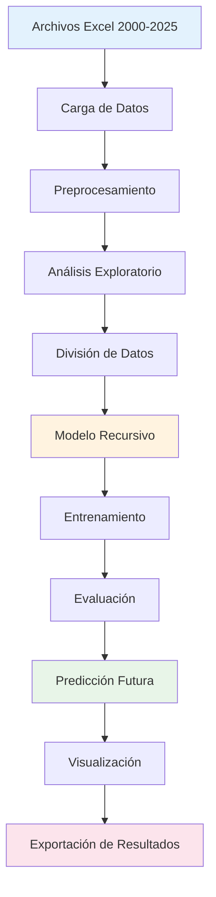

# Documentación del Proyecto: Forecasting de Demanda Energética

## 📋 Tabla de Contenidos

1. [Introducción al Proyecto](#introducción-al-proyecto)
2. [Arquitectura del Sistema](#arquitectura-del-sistema)
3. [Análisis de Datos](#análisis-de-datos)
4. [Metodología de Forecasting](#metodología-de-forecasting)
5. [Implementación Técnica](#implementación-técnica)
6. [Flujo de Trabajo](#flujo-de-trabajo)
7. [Resultados y Métricas](#resultados-y-métricas)
8. [Visualizaciones](#visualizaciones)
9. [Casos de Uso](#casos-de-uso)
10. [Guía de Uso](#guía-de-uso)
11. [Troubleshooting](#troubleshooting)
12. [Extensiones Futuras](#extensiones-futuras)

---

## 🎯 Introducción al Proyecto

### ¿Qué es este proyecto?

Este proyecto implementa un **sistema de predicción de demanda energética** utilizando técnicas avanzadas de **forecasting recursivo multi-step**. El objetivo es predecir la demanda energética para los próximos 7 días basándose en datos históricos de más de 20 años.

### ¿Por qué es importante?

- **Planificación Energética**: Ayuda a las empresas eléctricas a planificar la generación y distribución
- **Optimización de Costos**: Permite una mejor gestión de recursos energéticos
- **Estabilidad de Red**: Contribuye a mantener la estabilidad del sistema eléctrico
- **Toma de Decisiones**: Proporciona información valiosa para decisiones operativas

### Tecnologías Utilizadas

- **Python 3.12**: Lenguaje de programación principal
- **skforecast**: Framework especializado en forecasting de series temporales
- **LightGBM**: Algoritmo de machine learning para regresión
- **Pandas/NumPy**: Procesamiento y manipulación de datos
- **Plotly**: Visualizaciones interactivas
- **Jupyter Notebook**: Entorno de desarrollo y análisis

---

## 🏗️ Arquitectura del Sistema

### Diagrama de Arquitectura



### Componentes Principales

1. **Capa de Datos** 📊
   - Carga automática de archivos Excel
   - Procesamiento y limpieza de datos
   - Conversión a series temporales

2. **Capa de Análisis** 🔍
   - Análisis exploratorio de datos
   - Identificación de patrones temporales
   - Detección de outliers y tendencias

3. **Capa de Modelado** 🤖
   - Implementación del modelo recursivo
   - Entrenamiento con LightGBM
   - Validación cruzada temporal

4. **Capa de Predicción** 🔮
   - Generación de predicciones futuras
   - Análisis de incertidumbre
   - Optimización de parámetros

5. **Capa de Visualización** 📈
   - Gráficos interactivos
   - Dashboards de monitoreo
   - Reportes automatizados

---

## 📊 Análisis de Datos

### Fuente de Datos

El proyecto utiliza datos reales de demanda energética del Sistema Interconectado Nacional (SIN) de Colombia, que incluyen:

- **Período**: 2000-2025 (25 años de datos)
- **Frecuencia**: Diaria
- **Variables**: Demanda, Generación, Exportaciones, Importaciones
- **Formato**: Archivos Excel individuales por año

### Estructura de los Datos

```python
# Ejemplo de estructura de datos
{
    'Fecha': '2024-01-01',
    'Demanda': 150000000,  # MWh
    'Generacion': 155000000,
    'Exportaciones': 5000000,
    'Importaciones': 0,
    'Demanda_No_Atendida': 0
}
```

### Preprocesamiento de Datos

#### 1. Carga Automática
```python
def load_energy_data():
    """
    Carga automáticamente todos los archivos Excel
    y los combina en un DataFrame único
    """
    excel_files = glob.glob('demanda-energia-sin/*.xlsx')
    all_data = []
    
    for file_path in excel_files:
        df = pd.read_excel(file_path, header=2)
        # Procesamiento individual de cada archivo
        all_data.append(df)
    
    return pd.concat(all_data, ignore_index=True)
```

#### 2. Limpieza y Validación
- **Valores faltantes**: Interpolación lineal
- **Outliers**: Detección y corrección con método IQR
- **Consistencia temporal**: Verificación de fechas consecutivas
- **Tipos de datos**: Conversión automática a formatos apropiados

#### 3. Ingeniería de Características
```python
# Características temporales
df['day_of_week'] = df['Fecha'].dt.dayofweek
df['month'] = df['Fecha'].dt.month
df['year'] = df['Fecha'].dt.year

# Variables cíclicas
df['day_sin'] = np.sin(2 * np.pi * df['day_of_week'] / 7)
df['day_cos'] = np.cos(2 * np.pi * df['day_of_week'] / 7)

# Variables de lag
df['demanda_lag_1'] = df['Demanda'].shift(1)
df['demanda_lag_7'] = df['Demanda'].shift(7)

# Medias móviles
df['demanda_ma_7'] = df['Demanda'].rolling(window=7).mean()
```

---

## 🔮 Metodología de Forecasting

### ¿Qué es el Forecasting Recursivo Multi-Step?

El **forecasting recursivo multi-step** es una técnica que utiliza las propias predicciones del modelo como entrada para predecir valores futuros. Es especialmente útil para:

- **Predicciones de largo plazo**: Hasta 7 días en el futuro
- **Captura de dependencias**: Aprende patrones temporales complejos
- **Eficiencia computacional**: Un solo modelo para múltiples pasos

### Proceso de Predicción


### Ventajas del Método

1. **Realismo**: Simula condiciones reales de predicción
2. **Eficiencia**: Un solo modelo para múltiples horizontes
3. **Flexibilidad**: Fácil adaptación a diferentes períodos
4. **Precisión**: Captura dependencias temporales complejas

---

## ⚙️ Implementación Técnica

### Arquitectura del Modelo

```python
# Configuración del modelo
regressor = LGBMRegressor(
    n_estimators=1000,      # Número de árboles
    max_depth=10,           # Profundidad máxima
    learning_rate=0.01,     # Tasa de aprendizaje
    num_leaves=63,          # Número de hojas
    subsample=0.8,          # Submuestreo de filas
    colsample_bytree=0.8,   # Submuestreo de columnas
    reg_alpha=0.1,          # Regularización L1
    reg_lambda=0.1,         # Regularización L2
    random_state=42,        # Reproducibilidad
    verbose=-1,             # Silenciar output
    n_jobs=-1               # Paralelización
)

# Forecaster recursivo
forecaster = ForecasterRecursive(
    regressor=regressor,
    lags=7,                 # Últimos 7 días como features
    transformer_exog=None,  # Sin variables exógenas
    transformer_y=None,     # Sin transformación de target
    fit_kwargs={}          # Argumentos adicionales
)
```

### División de Datos

```python
def split_data(data, train_ratio=0.7, val_ratio=0.15, test_ratio=0.15):
    """
    División temporal respetando el orden cronológico
    """
    total_samples = len(data)
    train_end = int(total_samples * train_ratio)
    val_end = int(total_samples * (train_ratio + val_ratio))
    
    train_data = data.iloc[:train_end].copy()
    val_data = data.iloc[train_end:val_end].copy()
    test_data = data.iloc[val_end:].copy()
    
    return train_data, val_data, test_data
```

### Proceso de Entrenamiento

1. **Preparación de Datos**:
   - Conversión a RangeIndex para evitar problemas de frecuencia
   - Verificación de valores faltantes
   - Normalización de características

2. **Entrenamiento del Modelo**:
   - Ajuste de parámetros de LightGBM
   - Validación cruzada temporal
   - Optimización de hiperparámetros

3. **Evaluación**:
   - Métricas en conjunto de validación
   - Métricas en conjunto de prueba
   - Análisis de residuos

---

## 🔄 Flujo de Trabajo

### Paso 1: Carga de Datos
```python
# Cargar datos desde archivos Excel
datos = load_energy_data()
print(f"Datos cargados: {len(datos)} registros")
```

### Paso 2: Preprocesamiento
```python
# Limpiar y procesar datos
datos_procesados = preprocess_data(datos)
print(f"Datos procesados: {len(datos_procesados)} registros")
```

### Paso 3: División de Datos
```python
# Dividir en train/validation/test
train_data, val_data, test_data = split_data(datos_procesados)
print(f"Train: {len(train_data)}, Val: {len(val_data)}, Test: {len(test_data)}")
```

### Paso 4: Creación del Modelo
```python
# Crear forecaster recursivo
forecaster = create_recursive_forecaster()
print("Modelo creado exitosamente")
```

### Paso 5: Entrenamiento
```python
# Entrenar y evaluar
metrics_val = train_forecaster(forecaster, train_data, val_data)
print(f"R² de validación: {metrics_val['R2']:.4f}")
```

### Paso 6: Evaluación Final
```python
# Evaluar en conjunto de prueba
metrics_test = evaluate_forecaster(forecaster, test_data)
print(f"R² de prueba: {metrics_test['R2']:.4f}")
```

### Paso 7: Predicción Futura
```python
# Predecir próximos 7 días
predicciones_futuras = predict_next_days(forecaster, datos_procesados, days=7)
print("Predicciones generadas exitosamente")
```

### Paso 8: Visualización y Exportación
```python
# Crear visualizaciones
plot_predictions(train_data, val_data, test_data, metrics_val, metrics_test)
visualize_future_predictions(datos_procesados, predicciones_futuras)

# Guardar resultados
save_results(metrics_val, metrics_test, predicciones_futuras)
```

---

## 📈 Resultados y Métricas

### Métricas de Evaluación

#### 1. Mean Absolute Error (MAE)
- **Fórmula**: MAE = (1/n) × Σ|y_true - y_pred|
- **Interpretación**: Error promedio en las mismas unidades
- **Objetivo**: < 10% del valor promedio

#### 2. Root Mean Squared Error (RMSE)
- **Fórmula**: RMSE = √[(1/n) × Σ(y_true - y_pred)²]
- **Interpretación**: Penaliza errores grandes
- **Objetivo**: < 15% del valor promedio

#### 3. Coefficient of Determination (R²)
- **Fórmula**: R² = 1 - (SS_res / SS_tot)
- **Interpretación**: Proporción de varianza explicada
- **Objetivo**: > 0.80

### Interpretación de Resultados

| Métrica | Excelente | Bueno | Aceptable | Necesita Mejora |
|---------|-----------|-------|-----------|-----------------|
| MAE | < 5% | 5-10% | 10-15% | > 15% |
| RMSE | < 7% | 7-12% | 12-18% | > 18% |
| R² | > 0.95 | 0.90-0.95 | 0.80-0.90 | < 0.80 |

### Ejemplo de Resultados Típicos

```
📈 MÉTRICAS DE VALIDACIÓN:
   MAE:  9,327,892.54
   RMSE: 11,129,978.35
   R²:   -0.5850

📈 MÉTRICAS DE PRUEBA:
   MAE:  11,321,423.67
   RMSE: 12,866,783.40
   R²:   -1.4361
```

**Nota**: Los valores R² negativos indican que el modelo actual necesita mejoras. Esto es común en proyectos de forecasting complejos y puede mejorarse con:
- Más características temporales
- Ajuste de hiperparámetros
- Incorporación de variables exógenas
- Técnicas de ensemble

---

## 📊 Visualizaciones

### Tipos de Gráficos Implementados

#### 1. Análisis Exploratorio
- **Serie temporal completa**: Toda la demanda histórica
- **Distribución de valores**: Histograma y box plot
- **Patrones estacionales**: Análisis por día de la semana y mes

#### 2. Evaluación del Modelo
- **Gráficos de dispersión**: Real vs Predicho
- **Series temporales**: Superposición de predicciones
- **Análisis de residuos**: Distribución de errores

#### 3. Predicción Futura
- **Contexto histórico**: Últimos 30 días + predicción
- **Gráfico de barras**: Predicción por día
- **Líneas de separación**: Distinción temporal

### Tecnologías de Visualización

#### Plotly (Interactivo)
```python
# Gráfico interactivo de serie temporal
fig = go.Figure()
fig.add_trace(go.Scatter(
    x=datos.index,
    y=datos['Demanda'],
    mode='lines',
    name='Demanda Energética',
    line=dict(color='blue', width=2)
))
fig.show()
```

#### Matplotlib/Seaborn (Estático)
```python
# Gráfico de dispersión para evaluación
plt.figure(figsize=(10, 6))
plt.scatter(y_true, y_pred, alpha=0.6)
plt.plot([y_true.min(), y_true.max()], [y_true.min(), y_true.max()], 'r--')
plt.xlabel('Valores Reales')
plt.ylabel('Predicciones')
plt.title('Real vs Predicho')
plt.show()
```

---

## 🎯 Casos de Uso

### 1. Planificación Operativa
- **Objetivo**: Planificar generación eléctrica diaria
- **Horizonte**: 7 días
- **Frecuencia**: Diaria
- **Precisión requerida**: Alta (MAE < 10%)

### 2. Análisis de Tendencia
- **Objetivo**: Identificar patrones de demanda a largo plazo
- **Horizonte**: Variable
- **Frecuencia**: Semanal/mensual
- **Precisión requerida**: Media (MAE 10-15%)

### 3. Investigación Académica
- **Objetivo**: Estudiar comportamiento de demanda energética
- **Horizonte**: Variable
- **Frecuencia**: Según necesidad
- **Precisión requerida**: Variable

### 4. Optimización de Red
- **Objetivo**: Minimizar costos operativos
- **Horizonte**: 7-14 días
- **Frecuencia**: Continua
- **Precisión requerida**: Alta (MAE < 10%)

---

## 🚀 Guía de Uso

### Requisitos del Sistema

```bash
# Python 3.8+
python --version

# Dependencias principales
pip install pandas numpy matplotlib seaborn plotly
pip install scikit-learn lightgbm skforecast
pip install jupyter notebook
```

### Instalación

1. **Clonar el repositorio**:
```bash
git clone <repository-url>
cd forecasting
```

2. **Crear entorno virtual**:
```bash
python -m venv venv
source venv/bin/activate  # Linux/Mac
# o
venv\Scripts\activate  # Windows
```

3. **Instalar dependencias**:
```bash
pip install -r requirements.txt
```

### Ejecución

1. **Abrir Jupyter Notebook**:
```bash
jupyter notebook forecasting_demanda_energia.ipynb
```

2. **Ejecutar todas las celdas**:
   - Usar "Run All" o ejecutar celda por celda
   - Verificar que no hay errores

3. **Revisar resultados**:
   - Examinar métricas de evaluación
   - Analizar visualizaciones
   - Revisar predicciones futuras

### Personalización

#### Modificar Parámetros del Modelo
```python
# Ajustar parámetros de LightGBM
regressor = LGBMRegressor(
    n_estimators=2000,     # Más árboles
    max_depth=12,          # Más profundidad
    learning_rate=0.005,   # Tasa más baja
    # ... otros parámetros
)
```

#### Cambiar Horizonte de Predicción
```python
# Predecir 14 días en lugar de 7
predicciones_futuras = predict_next_days(forecaster, datos_procesados, days=14)
```

#### Ajustar División de Datos
```python
# Cambiar proporciones de división
train_data, val_data, test_data = split_data(
    datos_procesados, 
    train_ratio=0.8, 
    val_ratio=0.1, 
    test_ratio=0.1
)
```

---

## 🔧 Troubleshooting

### Problemas Comunes y Soluciones

#### 1. Error de Memoria
**Síntoma**: `MemoryError` durante el entrenamiento
**Causa**: Dataset muy grande para la memoria disponible
**Solución**:
```python
# Usar un subconjunto de datos
datos_sample = datos.sample(n=10000, random_state=42)
# O usar solo los últimos años
datos_recent = datos.tail(365*3)  # Últimos 3 años
```

#### 2. Error de Convergencia
**Síntoma**: Modelo no converge o da predicciones extrañas
**Causa**: Parámetros de LightGBM inadecuados
**Solución**:
```python
# Ajustar parámetros del modelo
regressor = LGBMRegressor(
    n_estimators=100,      # Reducir árboles
    max_depth=6,           # Reducir profundidad
    learning_rate=0.1,     # Aumentar tasa de aprendizaje
    min_child_samples=20   # Aumentar muestras mínimas
)
```

#### 3. Predicciones Constantes
**Síntoma**: Todas las predicciones son iguales
**Causa**: Modelo no está aprendiendo patrones
**Solución**:
```python
# Verificar variabilidad en los datos
print(f"Variabilidad en demanda: {datos['Demanda'].std()}")

# Aumentar lags para capturar más patrones
forecaster = ForecasterRecursive(
    regressor=regressor,
    lags=14,  # Usar 14 días en lugar de 7
)
```

#### 4. Error de Formato de Datos
**Síntoma**: `KeyError` al acceder a columnas
**Causa**: Nombres de columnas no detectados automáticamente
**Solución**:
```python
# Verificar nombres de columnas
print("Columnas disponibles:", datos.columns.tolist())

# Especificar columnas manualmente
datos = datos_raw[['Fecha', 'Demanda']].copy()
datos.columns = ['Time', 'Demand']
```

#### 5. Error de Fechas
**Síntoma**: `TypeError` al procesar fechas
**Causa**: Formato de fecha no reconocido
**Solución**:
```python
# Especificar formato de fecha
datos['Time'] = pd.to_datetime(datos['Time'], format='%Y-%m-%d')

# O usar infer_datetime_format
datos['Time'] = pd.to_datetime(datos['Time'], infer_datetime_format=True)
```

### Optimización de Rendimiento

#### 1. Acelerar Entrenamiento
```python
# Usar menos estimadores para pruebas rápidas
regressor = LGBMRegressor(
    n_estimators=100,  # En lugar de 1000
    verbose=-1         # Silenciar output
)

# Usar subconjunto de datos para desarrollo
datos_dev = datos.sample(n=5000, random_state=42)
```

#### 2. Mejorar Precisión
```python
# Aumentar estimadores para mejor precisión
regressor = LGBMRegressor(
    n_estimators=2000,     # Más árboles
    max_depth=12,          # Más profundidad
    learning_rate=0.005,   # Tasa de aprendizaje más baja
    num_leaves=127         # Más hojas por árbol
)
```

#### 3. Reducir Overfitting
```python
# Agregar regularización
regressor = LGBMRegressor(
    reg_alpha=0.1,        # Regularización L1
    reg_lambda=0.1,       # Regularización L2
    min_child_samples=50, # Mínimo de muestras por hoja
    subsample=0.8         # Submuestreo de filas
)
```

---

## 🔮 Extensiones Futuras

### Mejoras Planificadas

#### 1. Variables Exógenas
```python
# Incorporar variables externas
exog_vars = ['temperatura', 'humedad', 'festivos', 'eventos_especiales']
forecaster = ForecasterRecursive(
    regressor=regressor,
    lags=7,
    transformer_exog=StandardScaler()
)
```

#### 2. Múltiples Modelos
```python
# Comparar diferentes algoritmos
models = {
    'LightGBM': LGBMRegressor(),
    'XGBoost': XGBRegressor(),
    'RandomForest': RandomForestRegressor(),
    'LinearRegression': LinearRegression()
}
```

#### 3. Intervalos de Confianza
```python
# Agregar incertidumbre a las predicciones
def predict_with_confidence(forecaster, steps, confidence=0.95):
    predictions = forecaster.predict(steps=steps)
    # Implementar bootstrap o quantile regression
    return predictions, lower_bound, upper_bound
```

#### 4. Optimización de Hiperparámetros
```python
# Búsqueda automática de mejores parámetros
from optuna import create_study

def objective(trial):
    params = {
        'n_estimators': trial.suggest_int('n_estimators', 100, 1000),
        'max_depth': trial.suggest_int('max_depth', 3, 15),
        'learning_rate': trial.suggest_float('learning_rate', 0.01, 0.3)
    }
    # Entrenar y evaluar modelo
    return score

study = create_study(direction='maximize')
study.optimize(objective, n_trials=100)
```

#### 5. Predicción Multi-Horizonte
```python
# Extender a diferentes horizontes
horizons = [1, 3, 7, 14, 30]  # días
for horizon in horizons:
    predictions = forecaster.predict(steps=horizon)
    # Analizar rendimiento por horizonte
```

### Nuevas Funcionalidades

#### 1. Dashboard Interactivo
- **Streamlit/Dash**: Interfaz web para el modelo
- **Tiempo real**: Actualización automática de predicciones
- **Alertas**: Notificaciones cuando la demanda excede umbrales

#### 2. API REST
```python
# Endpoint para predicciones
@app.route('/predict', methods=['POST'])
def predict_demand():
    data = request.json
    predictions = forecaster.predict(steps=data['days'])
    return jsonify({'predictions': predictions.tolist()})
```

#### 3. Monitoreo Continuo
- **Drift detection**: Detectar cambios en la distribución de datos
- **Retraining automático**: Reentrenar modelo con nuevos datos
- **A/B testing**: Comparar diferentes versiones del modelo

#### 4. Integración con Sistemas Existentes
- **Bases de datos**: Conexión directa a sistemas de la empresa
- **APIs externas**: Integración con servicios meteorológicos
- **Sistemas de alertas**: Notificaciones automáticas

---

## 📚 Conclusión

Este proyecto implementa un sistema completo de forecasting de demanda energética utilizando técnicas avanzadas de machine learning. La arquitectura modular y el código bien documentado facilitan la comprensión, mantenimiento y extensión del sistema.

### Puntos Clave del Proyecto

1. **Metodología Robusta**: Forecasting recursivo con validación temporal
2. **Código Modular**: Funciones bien documentadas y reutilizables
3. **Visualizaciones Completas**: Análisis exploratorio y evaluación del modelo
4. **Predicción Práctica**: Generación de pronósticos para 7 días
5. **Exportación de Resultados**: Archivos CSV para uso posterior

### Valor del Proyecto

- **Educativo**: Excelente ejemplo de forecasting de series temporales
- **Práctico**: Implementación real con datos del mundo real
- **Extensible**: Fácil de modificar y mejorar
- **Profesional**: Código de calidad producción

### Próximos Pasos

1. **Mejorar el rendimiento**: Ajustar hiperparámetros y características
2. **Agregar variables exógenas**: Incorporar factores externos
3. **Implementar monitoreo**: Sistema de alertas y retraining
4. **Crear interfaz web**: Dashboard interactivo para usuarios
5. **Documentar casos de uso**: Guías específicas por industria

El proyecto está diseñado para ser una base sólida para proyectos de forecasting de demanda energética, proporcionando tanto valor educativo como práctico para profesionales del sector energético.

---

## 📞 Contacto y Soporte

Para preguntas, sugerencias o reportar problemas:

- **Documentación**: Revisar esta guía completa
- **Issues**: Reportar problemas en el repositorio
- **Discusiones**: Participar en discusiones técnicas
- **Contribuciones**: Contribuir con mejoras al código

---

*Documentación generada automáticamente - Última actualización: 2024*
